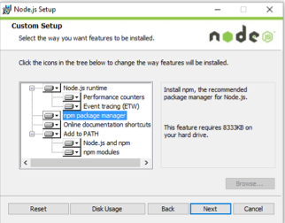
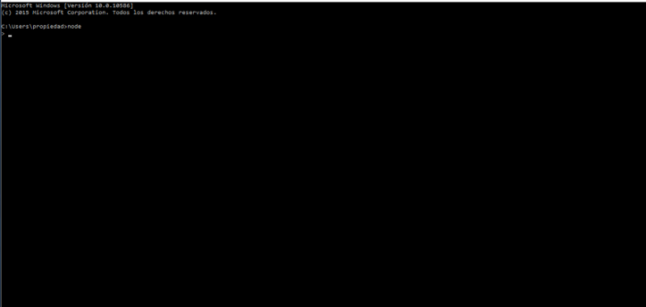
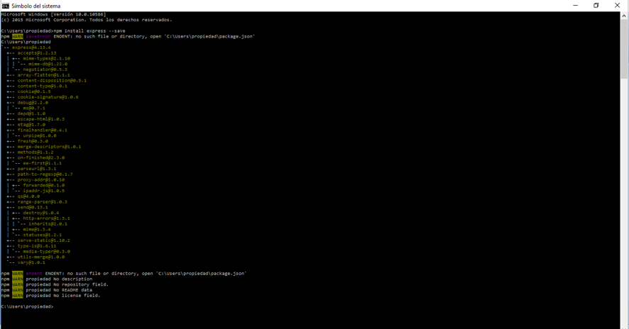
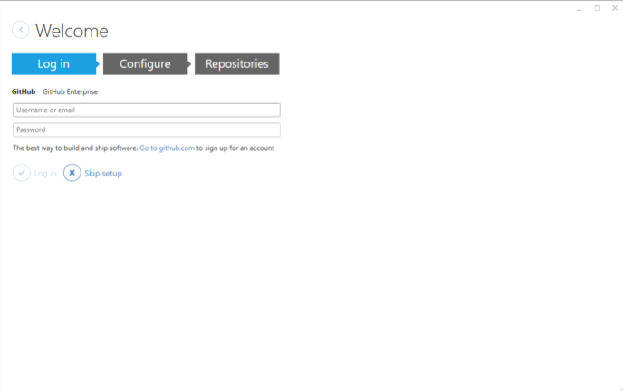
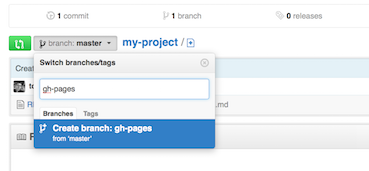
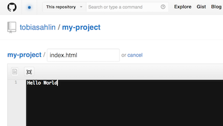
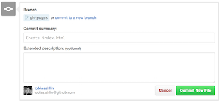

#### Samuel Ramos Barroso
#### Escuela Técnica Superior de Ingenieria informática - ULL
#### Asignatura Desarrollo de Sistemas Informáticos

___
```
* NodeJS
* Express
* GitHub Desktop
* Atom
* Cloud9
* Markdown
* Configurar gh-pages
```

___

#NodeJS

*NodeJS* es un entorno en tiempo de ejecución multiplataforma,  de código abierto Fue creado con el enfoque de ser útil en la creación de programas de red altamente escalables, como por ejemplo, servidores web.

Para instalar **NodeJS** vamos a la página y descargamos el instalador  [NodeJS](https://nodejs.org)




Comprobamos que la casilla del npm está habilitada.

Node Funcionando correctamente.



___

#Express

*Express* es una infraestructura de aplicaciones web *Node.js* mínima y flexible que proporciona un conjunto sólido de características para las aplicaciones web y móviles.
Para instalar **Express** introduce el siguiente comando en la términal: 

> ` $ npm install express --save `



___

#Github Desktop

*Github Desktop* Es una aplicación de escritorio para usar github en Mac y Windows 

Vamos a la página de Github Desktop y descargamos el instalador [GitHub Desktop](https://desktop.github.com)


Instalamos la aplicación y nos logeamos en la aplicación.



___

#Atom
Atom es un procesador de texto de código abierto para Mac, Linux y Windows con soporte para aplicaciones escritas en NodeJS, que cinlcuye software de control de versiones, fue desarrollado por GitHub

Para instalar Atom nos vamos a la página y descargamos el instalador [Atom IDE](https://atom.io)


___

#Cloud9

Es un IDE de desarrollo online, si disponemos de algún proyecto en un repositorio de GitHub podremos asociarlo a Cloud9 para trabajar en él tan solo creando un “nuevo workspace” y añadiendo la url git del correspondiente repositorio.


___

#Markdown

Markdown es un lenguaje de marcado ligero que trata de conseguir la máxima legibilidad y facilidad de publicación tanto en sus forma de entrada como de salida, inspirándose en muchas convenciones existentes para marcar mensajes de correo electrónico usando texto plano.

Sintaxis:

Encabezados
```
# Encabezado H1
## Encabezado H2
### Encabezado H3
```
Tipografía
```
**Negrita**
*Cursiva*
> Citas
Parrafo separar por lineas en blanco
`Codigo`
```
Recursos
```

* [Links](https://example.com)
```
Listas
```
1. Lista 1
2. Lista 2

* Lista 1
* Lista 2
```
___

#Pandoc

Descargamos Pandoc de la siguiente página y lo instalamos [Pandoc](http://pandoc.org/installing.html)
Introducimos el siguiente comando para realizar la conversión

> `  pandoc index.md -f markdown -t html -s -o index.html ` 


___

#gh-pages

**gh-pages** te permite crear páginas para tus proyectos, simplemente creandolas y pusheandolas.

Creamos la rama gh-pages



Creamos el fichero index.html



Ralizamos el commit y pusheamos




 


